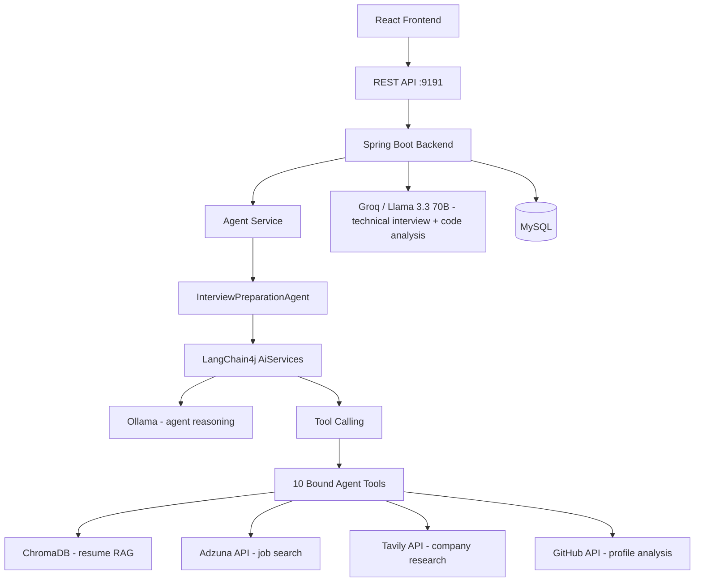
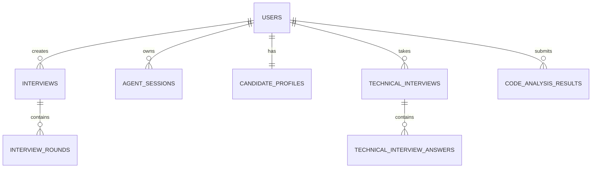

<div align="center">

# 🤖 Agentic AI Interview Preparation System

**Resume-Aware • RAG-Powered • Tool-Calling • Personalized Interview Preparation**

An AI agent that reads a candidate's resume, GitHub profile, target job descriptions, and past interview performance — then dynamically calls specialized tools to generate personalized preparation recommendations. Built on LangChain4j, Spring Boot, and a retrieval-augmented reasoning pipeline.

<br/>

[](#)
[](#)
[](#)
[](#)
[](#)
[](#)
[](#)
[](#)

<br/>

**[Backend Repository](https://github.com/ArunDev-07/AI-InterviewSystem-Backend) · [Frontend Repository](https://github.com/ArunDev-07/AI-InterviewSystem-Frontend) · [Portfolio](https://arun-g.vercel.app) · [LinkedIn](https://www.linkedin.com/in/arun-g-dev/)**

</div>

<br/>

---

## macOS-Style System Overview

<div align="center">

```
╭───────────────────────────────────────────────────────────────╮
│  ● ● ●        Agentic AI Interview Preparation — Overview      │
├───────────────────────────────────────────────────────────────┤
│                                                                 │
│   Resume  ──▶  AI Agent  ──▶  Tools  ──▶  RAG  ──▶  Plan       │
│                                                                 │
│   Candidate                                                    │
│      │                                                         │
│      ▼                                                         │
│   Resume / GitHub / Job Description                            │
│      │                                                         │
│      ▼                                                         │
│   Agentic AI Reasoning Engine (local Ollama, tool-calling)      │
│      │                                                         │
│      ▼                                                         │
│   Tool Selection                                                │
│      │                                                         │
│      ▼                                                         │
│   RAG Retrieval (ChromaDB)                                      │
│      │                                                         │
│      ▼                                                         │
│   Personalized Interview Strategy                              │
│      │                                                         │
│      ▼                                                         │
│   Preparation Plan                                              │
│                                                                 │
╰───────────────────────────────────────────────────────────────╯
```

</div>

---

## Why Agentic AI?

Most "AI interview prep" tools are a thin wrapper around a single prompt:

```
Traditional chatbot:

User ──▶ LLM ──▶ Response
```

This system routes requests through an **agent** (`InterviewPreparationAgent`, built with LangChain4j's `AiServices` and 10 bound tools) that reasons about what it needs, decides which tools to call, retrieves candidate-specific context, and only then composes a final answer:

```
This system:

User
  │
  ▼
Agent
  │
  ▼
Reasoning
  │
  ▼
Tool Selection
  │
  ▼
Tool Execution
  │
  ▼
Data Retrieval
  │
  ▼
RAG
  │
  ▼
Reasoning
  │
  ▼
Final Personalized Response
```

The agent's own tool-calling loop runs on a **local Ollama model** (configurable, defaults to `qwen2.5`), separate from the Groq-hosted model used for non-agent AI features like technical interview generation and code analysis. The agent's tool docstrings are deliberately strict about call order and valid inputs (e.g. *"call `analyzeSkillGap` only after `searchResume` and `analyzeJobDescription`"*), which constrains — but does not eliminate — the model's freedom in deciding what to call. This is tool-calling agentic behavior within a fixed toolset, not unsupervised autonomous action.

---

## Core Features

| Feature | What it does |
|---|---|
| 🧠 Agentic AI Interview Preparation | `InterviewPreparationAgent` reasons over a request and orchestrates the right combination of 10 bound tools to answer it. |
| 📄 Resume RAG | Apache PDFBox extracts resume text, LangChain4j splits it into 600-character chunks (100-char overlap), embeds each chunk via Ollama (`nomic-embed-text`), and stores vectors in ChromaDB scoped to the candidate. `ResumeRagTool.searchResume()` retrieves relevant chunks on demand. |
| 🔎 Job Search | `JobSearchTool` queries the **Adzuna** job search API (India listings) via `JobSearchService`. |
| 💼 Job Description Analysis | `JobDescriptionTool` extracts required skills, experience level, and responsibilities from a pasted job posting — and rejects input that isn't an actual job description. |
| 🐙 GitHub Profile Analysis | `GithubTool` + `GithubService` call the GitHub REST API to analyze public repositories and profile signals (optionally authenticated via a PAT for higher rate limits). |
| 🏢 Company Research | `CompanyResearchTool` + `CompanyResearchService` use the **Tavily** web search API to research a specific, named company. |
| 🎯 Company Recommendation | `CompanyRecommendationTool` matches the candidate's *saved* profile against current Adzuna job listings — it explicitly does not rely on the model's own knowledge of company names. |
| 📊 Skill Gap Analysis | `SkillGapTool` compares candidate skills (from resume RAG) against required skills (from job description analysis) to find matches, gaps, and priorities. |
| 📈 Interview Performance Analysis | `InterviewPerformanceTool` pulls the candidate's scores and AI feedback from past Aptitude / Communication / DSA / HR rounds. |
| 🗺️ Personalized Preparation Planner | `PreparationPlannerTool` combines skill gaps, past performance, and job requirements into a prioritized plan. |
| 👤 Candidate Profile | `CandidateProfileTool` + `CandidateProfileService` persist a long-term profile (recommended role, skills, projects, verified GitHub username) that survives across sessions. |
| 💬 Agent Chat | `POST /api/agent/chat` — conversational entry point into the agent. |
| 📎 Agent Chat with Resume | `POST /api/agent/chat-with-resume` — same as above, but accepts a resume file inline for the turn, ingesting it into Chroma immediately so the agent can query it in the same conversation. |
| 🧠 Agent Session Memory | `AgentSession` (JPA-backed) persists sessions; each agent instance keeps a rolling 20-message chat memory window per session via LangChain4j's `MessageWindowChatMemory`. |
| 🔐 JWT Authentication | `JwtService` + `JwtFilter` issue and validate stateless JWTs; passwords hashed with BCrypt (strength 12). |
| 👑 Role-Based Access Control | Spring Security enforces `ROLE_USER` / `ROLE_ADMIN` at the request-matcher level (e.g. `/api/admin/**` requires `ADMIN`). |
| 💻 AI Code Analysis | `POST /api/analyze-code` — code correctness, time/space complexity, and optimization suggestions via the Groq-hosted model. |
| 🎙️ Technical Interview | `TechnicalInterviewService` runs resume-driven technical interview sessions: upload → personalized questions → scored answers → follow-ups → final report. |
| 📚 Interview History | Past interview rounds and technical interview results are persisted and retrievable per user. |
| 📘 API Documentation | Swagger / OpenAPI UI is available at `/swagger-ui` and `/v3/api-docs` (both left publicly accessible in `SecurityConfig`). |

---

## 🧩 Agent Tools

The agent does not call every tool on every request — `ToolActivityRecorder` logs which tools were actually invoked for a given turn, and tool docstrings enforce ordering (e.g. skill-gap analysis requires resume and job-description results first).

| Tool | Responsibility |
|---|---|
| `ResumeRagTool` | Retrieves relevant resume chunks (skills, projects, experience, education) via ChromaDB similarity search |
| `JobDescriptionTool` | Extracts structured requirements from a pasted job description |
| `SkillGapTool` | Compares candidate vs. required skills to find matches, gaps, and priorities |
| `GithubTool` | Analyzes a candidate's public GitHub repositories and profile |
| `JobSearchTool` | Searches live Adzuna job listings (India) by role/skills and optional location |
| `CompanyResearchTool` | Researches one named company via Tavily web search |
| `CompanyRecommendationTool` | Matches the candidate's saved profile against real job listings to suggest companies/jobs |
| `InterviewPerformanceTool` | Retrieves past round scores and AI feedback (Aptitude / Communication / DSA / HR) |
| `PreparationPlannerTool` | Synthesizes skill gaps, performance history, and job requirements into a plan |
| `CandidateProfileTool` | Reads and persists the candidate's long-term profile |

> Note: `TechKeywords` in the same package is a static keyword list used to support other tools' logic — it is not itself bound to the agent as a callable `@Tool`.

---

## Complete System Architecture



Two separate LLM paths exist in this codebase: the agent's own reasoning loop runs on a **local Ollama chat model**, while technical-interview question generation, evaluation, and code analysis run on a **Groq-hosted** OpenAI-compatible model (`llama-3.3-70b-versatile`), configured as the `@Primary` `ChatModel` bean.

---

## Agent Decision Flow

An illustrative example — the exact tool sequence varies depending on the request and what context is already available:

```
User:
"Which companies should I apply to?"

  │
  ▼
Agent receives request
  │
  ▼
Checks CandidateProfileTool for a saved profile
  │
  ▼
If missing: ResumeRagTool + GithubTool to analyze the candidate
  │
  ▼
CandidateProfileTool.saveCandidateProfile(...)
  │
  ▼
CompanyRecommendationTool (matches profile against live Adzuna listings)
  │
  ▼
Agent synthesizes results
  │
  ▼
Personalized recommendations
```

---

## RAG Pipeline

<div align="center">

```
╭──────────────────────────────────────────────╮
│  ● ● ●              Resume RAG Pipeline       │
├──────────────────────────────────────────────┤
│                                                │
│  Resume PDF                                   │
│     │                                         │
│     ▼                                         │
│  Apache PDFBox text extraction                │
│     │                                         │
│     ▼                                         │
│  LangChain4j DocumentSplitter                 │
│  (600-char chunks, 100-char overlap)          │
│     │                                         │
│     ▼                                         │
│  Ollama embeddings (nomic-embed-text)          │
│     │                                         │
│     ▼                                         │
│  ChromaDB (v2 API, per-user collection)       │
│     │                                         │
│     ▼                                         │
│  Similarity Retrieval                         │
│     │                                         │
│     ▼                                         │
│  Relevant Resume Context                      │
│     │                                         │
│     ▼                                         │
│  Agent / LLM                                  │
│     │                                         │
│     ▼                                         │
│  Personalized Answer                          │
│                                                │
╰──────────────────────────────────────────────╯
```

</div>

`PdfEmbeddingService` extracts and chunks resume text and generates embeddings; `ChromaService` talks to ChromaDB directly over its `/api/v2/tenants/{tenant}/databases/{database}/collections` REST API (no dedicated Chroma client library is used). Chunks are tagged with `username` and `interviewId` so retrieval stays scoped to the right candidate and session. This grounds agent responses in the candidate's actual resume content rather than the LLM's general knowledge.

---

## Interview System

### Standard Interview Rounds

The `RoundType` enum defines four rounds: **APTITUDE**, **COMMUNICATION**, **DSA**, **HR**.

```
Create Interview
  │
  ▼
Answer Questions
  │
  ▼
Submit Round
  │
  ▼
AI Evaluation
  │
  ▼
Round Score
  │
  ▼
Overall Result
  │
  ▼
Interview History
```

### Technical Interview

Driven by `TechnicalInterviewService`, using the candidate's actual resume to generate relevant questions:

```
Resume Upload
  │
  ▼
Resume Analysis
  │
  ▼
Personalized Technical Questions
  │
  ▼
Candidate Answers
  │
  ▼
AI Scoring
  │
  ▼
Feedback
  │
  ▼
Follow-up Questions
  │
  ▼
Final Report
```

---

## Code Analysis

```
Code Submission (POST /api/analyze-code)
  │
  ▼
AI Analysis (Groq)
  │
  ▼
Correctness
  │
  ▼
Time Complexity
  │
  ▼
Space Complexity
  │
  ▼
Mistake Detection
  │
  ▼
Optimization Suggestions
  │
  ▼
Stored Result
```

---

## Security Architecture

```
Registration (POST /public/register)
  │
  ▼
BCrypt Password Hashing (strength 12)
  │
  ▼
Login (POST /public/login)
  │
  ▼
JWT Generation (JwtService)
  │
  ▼
Frontend Stores Token
  │
  ▼
Authorization: Bearer <TOKEN>
  │
  ▼
JwtFilter
  │
  ▼
SecurityContext
  │
  ▼
Controller
  │
  ▼
Role-Based Authorization (ROLE_USER / ROLE_ADMIN)
```

Sessions are fully stateless (`SessionCreationPolicy.STATELESS`). A small set of endpoints (`/api/chat`, `/api/analyze-code`, `/api/aptitude-questions`) are deliberately left public in `SecurityConfig`; Swagger UI (`/swagger-ui/**`, `/v3/api-docs/**`) is also public. `/api/admin/**` and `/api/interviews/admin/**` require `ROLE_ADMIN`.

---

## Database Architecture

Entities and their actual `@Table` names:



`users` · `interviews` · `interview_rounds` · `technical_interviews` · `technical_interview_answers` · `code_analysis_results` · `agent_sessions` · `candidate_profiles`

---

## Tech Stack

| Layer | Technologies (as declared in `pom.xml`) |
|---|---|
| **Backend** | Java 21 · Spring Boot 3.4.5 · Spring Security · Spring Data JPA / Hibernate · Spring Validation |
| **Agentic AI** | LangChain4j 1.10.0 (`langchain4j`, `langchain4j-ollama`, `langchain4j-open-ai`) |
| **LLMs** | Ollama (local, agent reasoning) · Groq — `llama-3.3-70b-versatile` via OpenAI-compatible API (technical interview + code analysis) |
| **RAG / Embeddings** | ChromaDB (v2 REST API) · Ollama embeddings (`nomic-embed-text`) |
| **External APIs** | GitHub REST API · Adzuna (job search) · Tavily (company research) |
| **Database** | MySQL (`mysql-connector-j`) |
| **Document Processing** | Apache PDFBox 3.0.7 |
| **Auth** | `jjwt` (api/impl/jackson) 0.12.6, BCrypt |
| **Docs / Tooling** | springdoc-openapi (Swagger UI) · Lombok · dotenv-java · Maven |
| **Frontend** | React |

> A `spring.ai.model.chat=google-genai` property exists in `application.properties`, but no code in the repository references Spring AI's `ChatClient` or a Gemini/GenAI integration — it appears to be inactive configuration rather than a wired feature, so it is not listed as an active part of the stack above.

---

## Project Structure

Actual current layout (`src/main/java/com/example/AI_InterviewSystem/`):

```
com/example/AI_InterviewSystem/
├── AiInterviewSystemApplication.java
├── Configuration/
│   ├── AgentConfig.java
│   ├── AppConfig.java
│   ├── ChromaConfig.java
│   ├── CompanyResearchConfig.java
│   ├── EmbeddingConfig.java
│   ├── GithubConfig.java
│   ├── JobSearchConfig.java
│   ├── JwtFilter.java
│   ├── LangChainConfig.java
│   └── SecurityConfig.java
├── Controller/
│   ├── AdminDashboardController.java
│   ├── AgentController.java
│   ├── ChatController.java
│   ├── InterviewController.java
│   ├── TechnicalInterviewController.java
│   └── UserController.java
├── Dto/
│   ├── AgentChatRequest.java
│   ├── AgentChatResponse.java
│   ├── CodeAnalysisRequest.java
│   ├── CodeTestCase.java
│   ├── RoundSubmitRequest.java
│   ├── TechnicalInterviewAnswerRequest.java
│   ├── TechnicalInterviewNextQuestionRequest.java
│   ├── TechnicalInterviewQuestionDto.java
│   ├── TechnicalInterviewStartRequest.java
│   └── ToolExecutionEvent.java
├── Exception/
│   └── EmbeddingException.java
├── Model/
│   ├── AgentSession.java
│   ├── CandidateProfile.java
│   ├── CodeAnalysisResult.java
│   ├── Interview.java
│   ├── InterviewRound.java
│   ├── InterviewStatus.java
│   ├── RoundStatus.java
│   ├── RoundType.java
│   ├── TechnicalInterview.java
│   ├── TechnicalInterviewAnswer.java
│   ├── UserPrincipal.java
│   └── Users.java
├── Repository/
│   ├── AgentSessionRepository.java
│   ├── CandidateProfileRepository.java
│   ├── CodeAnalysisResultRepo.java
│   ├── InterviewRepository.java
│   ├── InterviewRoundRepository.java
│   ├── TechnicalInterviewAnswerRepository.java
│   ├── TechnicalInterviewRepository.java
│   └── UserRepo.java
├── Service/
│   ├── AdminDashboardService.java
│   ├── CandidateProfileService.java
│   ├── ChatService.java
│   ├── ChromaService.java
│   ├── CompanyRecommendationService.java
│   ├── CompanyResearchService.java
│   ├── GithubService.java
│   ├── InterviewService.java
│   ├── JobSearchService.java
│   ├── JwtService.java
│   ├── PdfEmbeddingService.java
│   ├── RagService.java
│   ├── TechnicalInterviewService.java
│   └── UserService.java
└── agent/
    ├── AgentRequestContext.java
    ├── AgentService.java
    ├── InterviewPreparationAgent.java
    ├── ToolActivityRecorder.java
    └── tools/
        ├── CandidateProfileTool.java
        ├── CompanyRecommendationTool.java
        ├── CompanyResearchTool.java
        ├── GithubTool.java
        ├── InterviewPerformanceTool.java
        ├── JobDescriptionTool.java
        ├── JobSearchTool.java
        ├── PreparationPlannerTool.java
        ├── ResumeRagTool.java
        ├── SkillGapTool.java
        └── TechKeywords.java
```

---

## API Reference

Pulled directly from `@RequestMapping` / `@*Mapping` annotations in the controllers.

### Public (no auth)

| Method | Endpoint | Description |
|---|---|---|
| `POST` | `/public/register` | Register a new user |
| `POST` | `/public/login` | Login, returns JWT |
| `GET` | `/api/chat` · `POST` `/api/chat` | Public chat endpoint (`ChatController`) |
| `POST` | `/api/analyze-code` | Submit code for AI analysis |
| `GET` | `/api/aptitude-questions` | Fetch aptitude question set |

### Agent (`/api/agent`, authenticated)

| Method | Endpoint | Description |
|---|---|---|
| `POST` | `/api/agent/chat` | Send a message to the agent |
| `POST` | `/api/agent/chat-with-resume` | Same as above, with an optional resume file attached (multipart) |
| `GET` | `/api/agent/sessions` | List the current user's agent sessions |

### Interviews (`/api/interviews`, `ROLE_USER`/`ROLE_ADMIN`)

| Method | Endpoint | Description |
|---|---|---|
| `POST` | `/api/interviews/start` | Start a new interview |
| `GET` | `/api/interviews/my` | Get current user's interviews |
| `GET` | `/api/interviews/admin/all` | (Admin) list all interviews |
| `GET` | `/api/interviews/{interviewId}/rounds` | Get rounds for an interview |
| `POST` | `/api/interviews/rounds/{roundId}/start` | Start a round |
| `POST` | `/api/interviews/rounds/{roundId}/submit` | Submit a round's answers |
| `GET` | `/api/interviews/{interviewId}/final-result` | Get overall result |

### Technical Interview (`/api/technical-interview`)

| Method | Endpoint | Description |
|---|---|---|
| `POST` | `/api/technical-interview/upload-resume` (multipart) | Upload resume PDF |
| `POST` | `/api/technical-interview/start` | Start technical interview |
| `POST` | `/api/technical-interview/answer` | Submit an answer |
| `POST` | `/api/technical-interview/next-question` | Get next AI-generated question |
| `POST` | `/api/technical-interview/{interviewId}/complete` | Complete the interview |
| `GET` | `/api/technical-interview/{interviewId}/result` | Get final report |
| `GET` | `/api/technical-interview/my` | Get user's technical interviews |

### Code Analysis (`/api`)

| Method | Endpoint | Description |
|---|---|---|
| `POST` | `/api/analyze-code/submit` | Submit code, persist result |
| `GET` | `/api/analyze-code/my` | Get own submission history |
| `GET` | `/api/analyze-code/admin/all` | (Admin) all submissions |

### Admin (`/api/admin`, `ROLE_ADMIN`)

| Method | Endpoint | Description |
|---|---|---|
| `GET` | `/api/admin/dashboard` | Platform stats overview |
| `GET` | `/api/admin/users` | All registered users |
| `GET` | `/api/admin/results` | All submissions |
| `GET` | `/api/admin/users/{username}/results` | Submissions for one user |
| `GET` | `/api/admin/candidates/rankings` | Score-based ranking |
| `GET` | `/api/admin/candidates/top5` | Top 5 candidates |
| `DELETE` | `/api/admin/results/{id}` | Delete a submission |

### User (`UserController`)

| Method | Endpoint | Description |
|---|---|---|
| `GET` | `/api/me` | Current authenticated user |
| `POST` | `/admin/adduser` · `/admin/register` | Admin-created user accounts |
| `GET` | `/admin/test` · `/user/test` | Role-check smoke test endpoints |

### API Docs

Interactive Swagger UI is live at `/swagger-ui` (spec at `/v3/api-docs`) — both intentionally public.

---

## Agent Chat Example

> Illustrative example based on the real tool set and call-order constraints described above — actual wording will vary by run.

**User:**
> "Analyze my profile and tell me which roles I should apply for."

**Agent (typical sequence for a first-time candidate):**
1. `getCandidateProfile()` — checks for an existing saved profile
2. `searchResume(...)` — pulls skills/projects/experience from the resume
3. `analyzeGithub(...)` — cross-checks public repository activity
4. `saveCandidateProfile(...)` — persists the derived profile
5. `searchJobs(...)` / `recommendCompanies()` — matches the profile against live Adzuna listings
6. `analyzeSkillGap(...)` — flags gaps against a target role, if one was specified

**Example final response:**

```
Based on your resume and GitHub activity, you're well positioned for
Backend / Full-Stack Java roles. I don't have interview history for you
yet, so this is based on skills and projects alone.

Suggested next steps:
- Strengthen distributed systems fundamentals before senior-level roles
- A few currently open roles matching your profile: [from live Adzuna search]
- Practice: DSA + system design rounds
```

---

## Getting Started

### Prerequisites

- Java 21
- Maven
- MySQL
- Ollama running locally, with a chat model (e.g. `qwen2.5`) and the `nomic-embed-text` embedding model pulled
- ChromaDB running locally (default `http://localhost:8000`)
- Groq API key
- (Optional) Adzuna `app_id`/`app_key`, Tavily API key, GitHub token — features degrade gracefully but with reduced functionality if these are left blank

### Setup

```bash
# 1. Clone the repository
git clone https://github.com/ArunDev-07/AI-InterviewSystem-Backend.git
cd AI-InterviewSystem-Backend

# 2. Create the database
mysql -u root -p -e "CREATE DATABASE AIInterviewSystem"

# 3. Configure environment variables — see table below
cp .env.example .env

# 4. Run the backend (default port 9191)
./mvnw spring-boot:run

# 5. Run the frontend (separate repository)
git clone https://github.com/ArunDev-07/AI-InterviewSystem-Frontend.git
cd AI-InterviewSystem-Frontend
npm install
npm start
```

Secrets must be provided as environment variables and never committed to source control.

---

## Docker

No `Dockerfile` or `docker-compose.yml` currently exists in this repository — containerized deployment is not yet implemented, despite being a common expectation for a project at this stage. See **Roadmap**.

---

## Environment Variables

| Variable | Purpose |
|---|---|
| `GROQ_API_KEY` | Groq LLM API access (used by `LangChainConfig`) |
| `GITHUB_TOKEN` | Optional GitHub API token, raises rate limit from 60/hr to 5,000/hr |
| `GEMINI_API_KEY` | Referenced by an inactive Spring AI config property — not required for current features |
| `adzuna.app-id` / `adzuna.app-key` | Adzuna job search API credentials |
| `tavily.api-key` | Tavily web search API key, used for company research |
| `spring.datasource.username` / `password` | MySQL connection credentials |

`.env` must never be committed — keep it out of source control alongside any locally-set `application.properties` secrets.

---

## Roadmap

> All items below are **planned/future** — not currently implemented.

- 🐳 Docker / Docker Compose packaging
- 🔊 Voice-controlled interview preparation agent
- 🧠 Longer-term agent memory beyond the current 20-message window
- 🔍 Additional job sources beyond Adzuna
- 📌 Automated job tracking
- 🗓️ Interview scheduling
- 📊 Advanced candidate analytics
- 🕸️ Multi-agent architecture
- ☁️ Cloud deployment
- 📈 Observability
- 🧪 Formal evaluation framework for agent tool-selection quality

---

## Engineering Notes

- Stateless REST APIs (`SessionCreationPolicy.STATELESS`)
- JWT-based authentication with BCrypt(12) password hashing
- Two distinct LLM paths: local Ollama for agent tool-calling, Groq-hosted Llama 3.3 70B for interview/code evaluation — a deliberate split rather than a single model doing everything
- Chat memory window sized to 20 messages, paired with an 8192-token Ollama context window specifically to avoid mid-conversation context truncation during multi-tool-call turns (documented directly in `AgentConfig`)
- RAG scoped per-candidate (`username` + `interviewId` tags in Chroma) rather than a single shared vector store
- Tool docstrings enforce call ordering and reject malformed inputs (e.g. a job title passed where a skill list is expected) instead of relying on prompt-level instructions alone
- Repository pattern for all JPA entities
- No performance benchmarks are published here, as none have been formally measured.

---

## Future Architecture

**Current:**

```
Single Agent
   │
   ▼
10 Bound Tools
   │
   ▼
Services (RAG, GitHub, Jobs, Company Research)
```

**Future (planned):**

```
Supervisor Agent
├── Interview Agent
├── Career Agent
├── Resume Agent
├── Job Search Agent
└── Company Research Agent
```

---

## Contributing

```bash
git checkout -b feature/your-feature
git add .
git commit -m "feat: describe your change"
git push origin feature/your-feature
```

Then open a Pull Request.

---

## License

No `LICENSE` file was found in the repository at the time of writing. Add one (e.g. MIT) if you intend the project to be openly licensed — until then, default copyright applies.

---

<div align="center">

### Built by Arun G

[GitHub](https://github.com/ArunDev-07) · [Portfolio](https://arun-g.vercel.app) · [LinkedIn](https://www.linkedin.com/in/arun-g-dev/)

</div>
